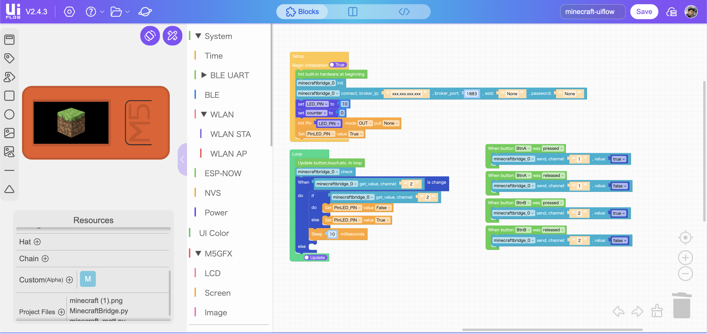
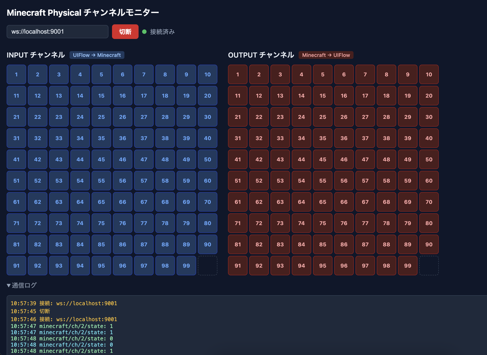

*このプロジェクトはスクリーンショット/動画素材/UIFlowサンプル以外、すべてClaude Codeがつくりました。*

# minecraft-physical

MinecraftのレッドストーンとM5StackデバイスをMQTTで双方向にブリッジするFabric MODプロジェクト。

```
[Minecraft]                     [M5Stackデバイス]
  チャンネルOUTブロック  →  LED、モーター、サーボ…
  チャンネルINブロック   ←  ボタン、センサー…
```

電子工作の入門教材として設計されており、UIFlowのビジュアルブロックからMicroPythonへ段階的に学習できます。

---

| ブロックを設置してチャンネル設定 | M5Stack ↔ Minecraft 双方向通信 | Minecraft経由でループ！ |
|:---:|:---:|:---:|
|  |  |  |

---

## 構成

```
minecraft-physical/
├── mod/       Fabric MOD (Minecraft 1.21.4 / Java 21)
├── m5flow/    M5Stack向けMicroPythonライブラリ・サンプル
└── tools/     ブラウザ用デバッグ・学習支援ツール
```

---

## 仕組み

3つのコンポーネントが同じWiFiネットワーク内で連携します。

```
[PC]
 ├─ Minecraft + Fabric MOD  ←→  MQTT  ←→  [M5Stackデバイス]
 └─ Mosquitto MQTTブローカー
```

**MQTTトピック:**

| トピック | 方向 | 用途 |
|---|---|---|
| `minecraft/ch/{n}/state` | Minecraft → M5Stack | OUTブロックの状態変化 |
| `minecraft/ch/{n}/input` | M5Stack → Minecraft | INブロックへの入力 |

**チャンネル番号** (1〜99) でMinecraftのブロックとM5Stack上の処理を対応付けます。INとOUTは独立しており、同じ番号をINとOUTの両方に設定しても問題ありません。

---

## セットアップ

### 必要なもの

- Minecraft Java Edition (Fabric対応)
- UIFlow v2 対応のM5Stackデバイス
- PC・M5Stackが同じWiFiに繋がっている環境

---

### Step 1: Mosquitto をインストール (PC)

MQTT通信の中継役となるブローカーです。

**macOS:**

```bash
brew install mosquitto
brew services start mosquitto
```

**Ubuntu / Debian:**

```bash
sudo apt install mosquitto
sudo systemctl start mosquitto
```

**Windows:**

1. [mosquitto.org/download](https://mosquitto.org/download/) から Windows用インストーラー (`mosquitto-2.x.x-install-windows-x64.exe`) をダウンロード
2. インストーラーを実行（デフォルト設定でOK）
3. サービスとして自動起動されます。手動で起動する場合:

```powershell
# PowerShell (管理者)
net start mosquitto

# または
mosquitto -v
```

> **Windowsファイアウォールの設定**
> インストール時にファイアウォールの許可ダイアログが出たら「許可」してください。
> 出なかった場合は「Windowsセキュリティ」→「ファイアウォール」→「アプリを許可」から `mosquitto` を追加します。

---

PCのIPアドレスをメモしておきます（M5Stackから接続するために使います）。

```bash
# macOS
ipconfig getifaddr en0

# Linux
hostname -I | awk '{print $1}'
```

```powershell
# Windows (PowerShell)
(Get-NetIPAddress -AddressFamily IPv4 -InterfaceAlias Wi-Fi).IPAddress
# または
ipconfig  # 「ワイヤレスLANアダプター Wi-Fi」のIPv4アドレスを確認
```

---

### Step 2: Fabric MOD をビルド・導入

**ビルド:**

```bash
# macOS / Linux
cd mod
./gradlew build
```

```powershell
# Windows (PowerShell)
cd mod
.\gradlew.bat build
```

`mod/build/libs/gpio-bridge-1.0.0.jar` が生成されます。

**導入:**

生成されたJARファイルをMinecraftの `mods/` フォルダにコピーします。

```
# macOS
~/Library/Application Support/minecraft/mods/

# Windows
%APPDATA%\.minecraft\mods\
```

エクスプローラーのアドレスバーに `%APPDATA%\.minecraft\mods` と入力すると直接開けます。

**設定ファイル** (`config/gpio_bridge.json`) は初回起動時に自動生成されます。
PCでMinecraftを動かす場合はデフォルト設定のままで動作します。

```json
{
  "brokerHost": "localhost",
  "brokerPort": 1883,
  "clientId": "minecraft-mod",
  "reconnectDelayMs": 5000
}
```

---

### Step 3: ライブラリを M5Stack にアップロード

1. UIFlow v2 (`flow2.m5stack.com`) を開いてデバイスを接続
2. 左パネルの「Files」タブを開く
3. `/flash/libs/` フォルダを作成
4. `m5flow/libs/minecraft_mqtt.py` をアップロード

---

### Step 4: サンプルプログラムを書き込む

`m5flow/examples/` のサンプルをUIFlow v2の「Python」タブに貼り付けます。

ファイル上部の `CONFIG` セクションを自分の環境に合わせて書き換えてください。

```python
WIFI_SSID     = 'あなたのSSID'
WIFI_PASSWORD = 'あなたのパスワード'
BROKER_IP     = '192.168.1.xxx'  # Step 1 で確認した PC の IP
```

---

## Minecraftでの使い方

### ブロックの入手

クリエイティブモードのインベントリ検索、またはコマンドで入手できます。

```
/give @p gpio_bridge:channel_in
/give @p gpio_bridge:channel_out
```

### チャンネルINブロック (M5Stack → Minecraft)

M5Stackから信号を受け取り、レッドストーン信号として出力するブロックです。

1. ブロックを設置
2. 右クリック → チャンネル番号 (1〜99) を入力 → Done
3. M5Stackからそのチャンネル番号に信号が来ると、ブロックが光ってレッドストーン信号を出力

### チャンネルOUTブロック (Minecraft → M5Stack)

レッドストーン信号を受け取り、M5Stackに信号を送るブロックです。

1. ブロックを設置
2. 右クリック → チャンネル番号 (1〜99) を入力 → Done
3. 隣にレッドストーントーチやレバーを置くと、ブロックが光り M5Stack に信号が届く

---

## M5Stackプログラムの書き方

`m5flow/libs/minecraft_mqtt.py` を読み込むことで、4つの関数が使えます。

```python
from libs.minecraft_mqtt import mc_setup, mc_on, mc_send, mc_check

# 1. 接続 (最初に一度だけ呼ぶ)
mc_setup('SSID', 'password', '192.168.1.xxx')

# 2. 受信コールバックを登録 (Minecraft OUTブロック → M5Stack)
def on_ch1(value):
    if value:
        print('チャンネル1: ON')
    else:
        print('チャンネル1: OFF')

mc_on(1, on_ch1)

# 3. Minecraft INブロックへ送信 (M5Stack → Minecraft)
mc_send(2, True)   # チャンネル2にONを送る
mc_send(2, False)  # チャンネル2にOFFを送る

# 4. メインループ内で必ず呼ぶ (受信処理)
while True:
    mc_check()
```

### サンプル一覧

| ファイル | 内容 |
|---|---|
| `examples/01_led_output.py` | Minecraft OUTブロック → LED点灯 |
| `examples/02_button_input.py` | ボタン押下 → Minecraft INブロック |
| `examples/03_bidirectional.py` | 双方向通信 (上記2つの組み合わせ) |

### UIFlow v2 カスタムブロックとして使う

#### 事前準備: WiFi設定の書き込み

UIFlow Burner でファームウェアを焼く際に、WiFi の SSID とパスワードを書き込んでおいてください。
こうすることでプログラムとWiFi設定を分離でき、プロジェクトファイルに認証情報が含まれません。

#### カスタムブロックの登録

`m5flow/uiflow2/MinecraftBridge.py` をUIFlow v2のCustomブロックエディタで登録すると、ビジュアルブロックとして使えます。

1. UIFlow v2 の Files タブ → `/flash/libs/` に `minecraft_mqtt.py` をアップロード
2. UIFlow v2 の Files タブ → `/flash/` に `MinecraftBridge.py` をアップロード
3. UIFlow v2 → Custom タブ → Block Designer → Python に `MinecraftBridge.py` を貼り付け → Update Blocks → Save .m5b2
4. Custom タブ → Load で保存した `.m5b2` を読み込む
5. ブロックパネルに MinecraftBridge カテゴリが追加される

#### サンプルプロジェクト

`m5flow/examples/minecraft-uiflow.m5f2` をUIFlow v2で開くとすぐに試せます。



**動作内容:**

| 操作 | 動き |
|---|---|
| BtnA 押す/離す | チャンネル1 に ON/OFF を送信 → Minecraft の IN ブロックが反応 |
| BtnB 押す/離す | チャンネル2 に ON/OFF を送信 → Minecraft の IN ブロックが反応 |
| チャンネル2 の state 受信 | LED が点灯/消灯 |

**実行前に必ず確認:** プロジェクト内のブローカー IP が `xxx.xxx.xxx.xxx` になっているので、自分の PC の IP アドレスに書き換えてください。

---

## チャンネルモニター (tools/mqtt-monitor.html)

MinecraftとUIFlowの間で飛び交うMQTT信号をブラウザ上で可視化・手動送信できるツールです。
目に見えない信号の流れを確認しながら動作を試せるため、セットアップの確認や学習に役立ちます。



### 画面構成

画面は2つのグリッドに分かれており、チャンネル1〜99を一覧できます。

| セクション | 色 | 対応トピック | 役割 |
|---|---|---|---|
| **INPUT チャンネル** (上段) | 青 | `minecraft/ch/{n}/input` | UIFlow → Minecraft の信号 |
| **OUTPUT チャンネル** (下段) | 赤 | `minecraft/ch/{n}/state` | Minecraft → UIFlow の信号 |

MQTTでメッセージが届くとそのチャンネルのマス目が点灯し、マス目をクリックすると手動で信号を送れます。

### クリック操作

| 操作 | 動作 |
|---|---|
| 左クリック / タップ | 0.5秒間だけONにしてOFFに戻す（パルス送信） |
| 右クリック / 長押し | 現在の値をON/OFFに切り替える（トグル送信） |

### 使い方

**1. MosquittoにWebSocketサポートを追加**

ブラウザからMQTTに接続するにはWebSocketが必要です。Mosquittoの設定ファイルに追記してください。

```
# macOS: /opt/homebrew/etc/mosquitto/mosquitto.conf
# Linux: /etc/mosquitto/mosquitto.conf
listener 1883
listener 9001
protocol websockets
allow_anonymous true
```

```bash
brew services restart mosquitto   # macOS
sudo systemctl restart mosquitto  # Linux
```

**2. ツールを開く**

`tools/mqtt-monitor.html` をブラウザで直接開き、接続先を入力して「接続」をクリックします。

```
ws://localhost:9001      # 同じPCから接続する場合
ws://192.168.1.xxx:9001  # スマートフォンや別PCから接続する場合
```

スマートフォンからアクセスする場合は、URLパラメータでブローカーアドレスを指定できます。

```
http://192.168.1.xxx:8080/tools/mqtt-monitor.html?broker=ws://192.168.1.xxx:9001
```

---

## トラブルシューティング

| 症状 | 確認ポイント |
|---|---|
| WiFiに繋がらない | SSID・パスワードを確認。ESP32は2.4GHz帯のみ対応 |
| MQTTに繋がらない | PC側のIPアドレス確認 / Mosquittoが起動しているか確認 |
| LEDが光らない | MinecraftのチャンネルOUTブロックとM5Stackのチャンネル番号が一致しているか確認 |
| MinecraftでINブロックが反応しない | M5Stackがコンソールにエラーを出していないか確認 |
| MODが読み込まれない | Fabric Loaderが導入済みか / JARがmods/フォルダにあるか確認 |
| (Windows) M5StackがMQTTに繋がらない | ファイアウォールでMosquittoのポート1883が許可されているか確認。`telnet 192.168.x.x 1883` で疎通確認 |
| (Windows) `gradlew.bat` が動かない | Java 21がインストールされているか確認。[Adoptium](https://adoptium.net/) からJava 21をインストール |

---

## クレジット

- `m5flow/examples/minecraft-uiflow.m5f2` 内の `minecraft (1).png`: [Minecraft Icon](https://iconscout.com/free-icon/free-minecraft-icon_282774) by IconScout
